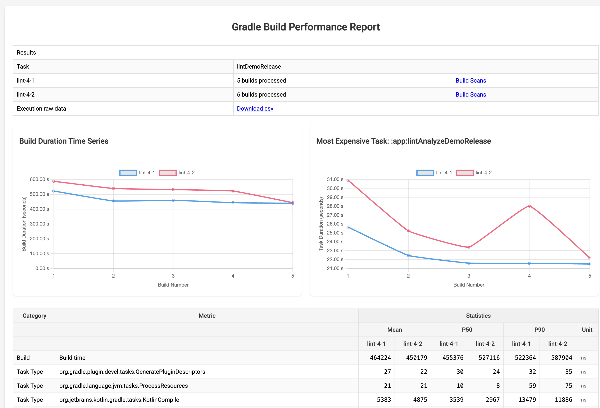

## BuildExperimentResults
A comprehensive build performance analysis tool that processes and compares Develocity build scan data for one or more
variants in an experiment. It analyzes build times, task execution, resource usage, and process metrics, providing
detailed statistical comparisons through multiple output formats including interactive charts, tables, and raw data exports.
The tool supports various report types including task analysis, resource usage, GC metrics, and process monitoring,
with optional OpenAI-powered analysis for deeper insights.

Beyond the analysis of a single variant, this tool allows for the comparison of multiple variants, making it suitable
for use in experimentation frameworks where two or more variants are defined in an experiment.

The tool is based on the information provided by Build Scans in Develocity.
This means it will provide metrics based on task paths, task types, the build process, and child processes.
Additionally, it incorporates extended metric information if the following plugins or extensions are applied to the project:
* [Kotlin Build Reports](https://blog.jetbrains.com/kotlin/2022/06/introducing-kotlin-build-reports/)
* [Info Kotlin Process](https://github.com/cdsap/InfoKotlinProcess)
* [Info Gradle Process](https://github.com/cdsap/InfoGradleProcess)
* [GC Report](https://github.com/cdsap/GCReport)


### Usage

#### Installation
```
 curl -L https://github.com/cdsap/BuildExperimentResults/releases/download/v1.1.0/build-experiment-results --output build-experiment-results
 chmod 0757 build-experiment-results
```
#### Simple Usage
```
./build-experiment-results --variants lint-4-1 \
    --api-key $GE_API \
    --url $GE_URL
```

Output:
```kotlin
──────────────────┬─────────────────────────────────────────────────────────────────────────────────────────────────────────────────────────────
│ Task            │ lintDemoRelease                                                                                                            │
├─────────────────┼────────────────────────────────────────────────────────────────────────────────────────────────────────────────────────────┤
│ lint-4-1        │ Builds processed: 5                                                                                                        │
├─────────────────┼────────────────────────────────────────────────────────────────────────────────────────┬───────────┬───────────┬───────────┤
│                 │                                                                                        │   Mean    │    P50    │    P90    │
│    Category     │                                         Metric                                         ├───────────┼───────────┼───────────┤
│                 │                                                                                        │ lint-4-1  │ lint-4-1  │ lint-4-1  │
├─────────────────┼────────────────────────────────────────────────────────────────────────────────────────┼───────────┼───────────┼───────────┤
│ build           │ build time                                                                             │ 464224 ms │ 455376 ms │ 522364 ms │
├─────────────────┼────────────────────────────────────────────────────────────────────────────────────────┼───────────┼───────────┼───────────┤
│ task type       │ org.gradle.plugin.devel.tasks.generateplugindescriptors                                │     27 ms │     30 ms │     32 ms │
├─────────────────┼────────────────────────────────────────────────────────────────────────────────────────┼───────────┼───────────┼───────────┤
│ task type       │ org.gradle.language.jvm.tasks.processresources                                         │     21 ms │     10 ms │     59 ms │
├─────────────────┼────────────────────────────────────────────────────────────────────────────────────────┼───────────┼───────────┼───────────┤
│ task type       │ org.jetbrains.kotlin.gradle.tasks.kotlincompile                                        │   5383 ms │   3539 ms │  13479 ms │
├─────────────────┼────────────────────────────────────────────────────────────────────────────────────────┼───────────┼───────────┼───────────┤
│ task type       │ org.gradle.api.tasks.compile.javacompile                                               │   1441 ms │    415 ms │   5014 ms │
├─────────────────┼────────────────────────────────────────────────────────────────────────────────────────┼───────────┼───────────┼───────────┤
...
generating html experiment_results_20250312155830.html
generating csv experiment_results_20250312155830.csv
generating gha summary
```

* `--variants`: name of the variant to analyze
* `--api-key`: Develocity Key
* `--url`: Develocity url

#### Comparing multiple variants Usage
```
./build-experiment-results --variants lint-4-1 --variants lint-2-1 \
    --api-key $GE_API \
    --url $GE_URL
```
Output:
```kotlin
┬─────────────────┬─────────────────────────────────────────────────────────────────────────────────────────────────────────────────────────────────────────────────────────────────
│ Task            │ lintDemoRelease                                                                                                                                                │
├─────────────────┼────────────────────────────────────────────────────────────────────────────────────────────────────────────────────────────────────────────────────────────────┤
│ lint-4-1        │ Builds processed: 5                                                                                                                                            │
├─────────────────┼────────────────────────────────────────────────────────────────────────────────────────────────────────────────────────────────────────────────────────────────┤
│ lint-4-2        │ Builds processed: 5                                                                                                                                            │
├─────────────────┼────────────────────────────────────────────────────────────────────────────────────────┬───────────────────────┬───────────────────────┬───────────────────────┤
│                 │                                                                                        │         Mean          │          P50          │          P90          │
│    Category     │                                         Metric                                         ├───────────┬───────────┼───────────┬───────────┼───────────┬───────────┤
│                 │                                                                                        │ lint-4-1  │ lint-4-2  │ lint-4-1  │ lint-4-2  │ lint-4-1  │ lint-4-2  │
├─────────────────┼────────────────────────────────────────────────────────────────────────────────────────┼───────────┼───────────┼───────────┼───────────┼───────────┼───────────┤
│ build           │ build time                                                                             │ 464224 ms │ 450179 ms │ 455376 ms │ 527116 ms │ 522364 ms │ 587904 ms │
├─────────────────┼────────────────────────────────────────────────────────────────────────────────────────┼───────────┼───────────┼───────────┼───────────┼───────────┼───────────┤
│ task type       │ org.gradle.plugin.devel.tasks.generateplugindescriptors                                │     27 ms │     22 ms │     30 ms │     24 ms │     32 ms │     35 ms │
├─────────────────┼────────────────────────────────────────────────────────────────────────────────────────┼───────────┼───────────┼───────────┼───────────┼───────────┼───────────┤
│ task type       │ org.gradle.language.jvm.tasks.processresources                                         │     21 ms │     21 ms │     10 ms │      8 ms │     59 ms │     75 ms │
├─────────────────┼────────────────────────────────────────────────────────────────────────────────────────┼───────────┼───────────┼───────────┼───────────┼───────────┼───────────┤
...
generating html charts experiment_results_20250312160008.html
generating csv experiment_results_20250312160008.csv
generating gha summary
```


#### The `variants` Parameter
The `--variants` parameter represents a set of builds identified by a Develocity tag. You can specify one or
multiple variants. When multiple variants are provided, the tool compares their metrics to facilitate experiments aimed
at evaluating the performance of different experiment variants. For example:

* Variant A: G1
* Variant B: Parallel

For a fair comparison, both variants should be executed under the same conditions in the same
environment, and with the same requested task. If your variants include builds with different tasks, you can specify the task
explicitly using the --requested-task parameter. Example:
```kotlin
--requested-task assembleDebug
```

### Complete list of parameters

#### Required Parameters
| Parameter | Description | Default |
|-----------|-------------|---------|
| `--api-key` | API key for authentication | - |
| `--url` | URL endpoint for the service | - |
| `--variants` | List of variants to compare (can be specified multiple times) | - |

#### Optional Parameters
| Parameter | Description                                                                                           | Default |
|-----------|-------------------------------------------------------------------------------------------------------|---------|
| `--max-builds` | Maximum number of builds to process (max: 1000)                                                       | 200 |
| `--project` | Project name to filter builds                                                                         | - |
| `--requested-task` | Specific task to analyze                                                                              | - |
| `--profile` | Enable profile mode (if the variant builds have origin in a gralde-profiler execution)                | false |
| `--warmups-to-discard` | Number of warmup builds to discard (if the variant builds have origin in a gralde-profiler execution) | 2 |
| `--threshold-task-duration` | Threshold for task duration in milliseconds                                                           | -1 |
| `--experiment-id` | Identifier for the experiment                                                                         | - |
| `--repository` | Repository name                                                                                       | - |
| `--experiment-run-id` | Identifier for the experiment run                                                                     | - |

#### Report Types
| Parameter | Description | Default |
|-----------|-------------|---------|
| `--task-path-report` | Task path analysis | enabled |
| `--task-type-report` | Task type analysis | enabled |
| `--kotlin-build-report` | Kotlin build report | disabled |
| `--resource-usage-report` | Resource usage analysis | enabled |
| `--process-report` | Process analysis | disabled |
| `--build-report` | Build report | enabled |
| `--gc-report` | Garbage collection analysis | disabled |

#### Additional Options
| Parameter | Description | Default |
|-----------|-------------|---------|
| `--only-cacheable-outcome` | Filter for cacheable outcomes only | disabled |
| `--open-ai-request` | Enable OpenAI analysis | disabled |
| `--open-ai-key` | OpenAI API key for analysis | - |

**Note**: At least one type of report must be enabled (task-path-report, task-type-report, kotlin-build-report, or process-report). All report types can be disabled using the `--no-` prefix (e.g., `--no-task-path-report`).


### Output Formats
The tool generates results in multiple formats:

#### Console Output
A detailed table showing:
- Experiment information (task, variants, number of builds processed)
- Metrics organized by category showing Mean, P50 (median), and P90 values for each variant
- Process state information when process reporting is enabled
- Task type and task path durations
```
┌───────────────────────────────────────────────────────────────────────────────────────────────────────────────────────────────────────────────────────────────────────────────────────────────────────────┐
│                                                                                                Experiment                                                                                                 │
├────────────────────────────┬──────────────────────────────────────────────────────────────────────────────────────────────────────────────────────────────────────────────────────────────────────────────┤
│ Experiment id              │ 154                                                                                                                                                                          │
├────────────────────────────┼──────────────────────────────────────────────────────────────────────────────────────────────────────────────────────────────────────────────────────────────────────────────┤
│ Experiment task            │ lintDemoRelease                                                                                                                                                              │
├────────────────────────────┼──────────────────────────────────────────────────────────────────────────────────────────────────────────────────────────────────────────────────────────────────────────────┤
│ lint-4-1                   │ Builds processed: 5                                                                                                                                                          │
├────────────────────────────┼──────────────────────────────────────────────────────────────────────────────────────────────────────────────────────────────────────────────────────────────────────────────┤
│ lint-2-1                   │ Builds processed: 5                                                                                                                                                          │
├────────────────────────────┼────────────────────────┬─────────────────────────────────────────────────┬─────────────────────────────────────────────────┬─────────────────────────────────────────────────┤
│                            │                        │                       Mean                      │                       P50                       │                       P90                       │
│          Category          │         Metric         ├────────────────────────┬────────────────────────┼────────────────────────┬────────────────────────┼────────────────────────┬────────────────────────┤
│                            │                        │ lint-4-1               │ lint-2-1               │ lint-4-1               │ lint-2-1               │ lint-4-1               │ lint-2-1               │
│                            │                        │                        │                        │                        │                        │                        │                        │
├────────────────────────────┼────────────────────────┼────────────────────────┼────────────────────────┼────────────────────────┼────────────────────────┼────────────────────────┼────────────────────────┤
│ Build                      │ Build time             │              513368 ms │              503779 ms │              473524 ms │              497573 ms │              599878 ms │              570158 ms │
├────────────────────────────┼────────────────────────┼────────────────────────┼────────────────────────┼────────────────────────┼────────────────────────┼────────────────────────┼────────────────────────┤
│ Gradle process state       │ Gradle-Process-capacit │                  1.93  │                  1.32  │                  1.91  │                  1.33  │                  2.02  │                  1.39  │
│                            │ y                      │                        │                        │                        │                        │                        │                        │
├────────────────────────────┼────────────────────────┼────────────────────────┼────────────────────────┼────────────────────────┼────────────────────────┼────────────────────────┼────────────────────────┤
│ Gradle process state       │ Gradle-Process-gcTime  │                  0.19  │                  0.22  │                  0.18  │                  0.22  │                  0.21  │                  0.26  │
├────────────────────────────┼────────────────────────┼────────────────────────┼────────────────────────┼────────────────────────┼────────────────────────┼────────────────────────┼────────────────────────┤
│ Gradle process state       │ Gradle-Process-max     │                   4.0  │                   2.0  │                   4.0  │                   2.0  │                   4.0  │                   2.0  │
├────────────────────────────┼────────────────────────┼────────────────────────┼────────────────────────┼────────────────────────┼────────────────────────┼────────────────────────┼────────────────────────┤
│ Gradle process state       │ Gradle-Process-uptime  │                  8.49  │                  8.32  │                  7.82  │                  8.23  │                  9.93  │                  9.43  │
├────────────────────────────┼────────────────────────┼────────────────────────┼────────────────────────┼────────────────────────┼────────────────────────┼────────────────────────┼────────────────────────┤
│ Gradle process state       │ Gradle-Process-usage   │                  1.25  │                  0.77  │                  1.31  │                   0.7  │                  1.63  │                  0.93  │
├────────────────────────────┼────────────────────────┼────────────────────────┼────────────────────────┼────────────────────────┼────────────────────────┼────────────────────────┼────────────────────────┤
│ Kotlin process state       │ Kotlin-Process-capacit │                  1.31  │                  0.77  │                  1.26  │                  0.78  │                  2.19  │                  0.85  │
│                            │ y                      │                        │                        │                        │                        │                        │                        │
├────────────────────────────┼────────────────────────┼────────────────────────┼────────────────────────┼────────────────────────┼────────────────────────┼────────────────────────┼────────────────────────┤
│ Kotlin process state       │ Kotlin-Process-gcTime  │                  0.05  │                  0.05  │                  0.05  │                  0.05  │                  0.06  │                  0.08  │
├────────────────────────────┼────────────────────────┼────────────────────────┼────────────────────────┼────────────────────────┼────────────────────────┼────────────────────────┼────────────────────────┤
│ Kotlin process state       │ Kotlin-Process-max     │                   4.0  │                   2.0  │                   4.0  │                   2.0  │                   4.0  │                   2.0  │
├────────────────────────────┼────────────────────────┼────────────────────────┼────────────────────────┼────────────────────────┼────────────────────────┼────────────────────────┼────────────────────────┤
│ Kotlin process state       │ Kotlin-Process-uptime  │                  4.87  │                  4.78  │                  4.58  │                  4.61  │                  6.15  │                   5.6  │
├────────────────────────────┼────────────────────────┼────────────────────────┼────────────────────────┼────────────────────────┼────────────────────────┼────────────────────────┼────────────────────────┤
│ Kotlin process state       │ Kotlin-Process-usage   │                  0.69  │                  0.47  │                  0.71  │                  0.53  │                  0.85  │                  0.59  │
├────────────────────────────┼────────────────────────┼────────────────────────┼────────────────────────┼────────────────────────┼────────────────────────┼────────────────────────┼────────────────────────┤
│                            │ org.jetbrains.kotlin.g │                        │                        │                        │                        │                        │                        │
│ Task Type                  │ radle.tasks.KotlinComp │                5481 ms │                5540 ms │                3539 ms │                3692 ms │               12574 ms │               12708 ms │
│                            │ ile                    │                        │                        │                        │                        │                        │                        │
├────────────────────────────┼────────────────────────┼────────────────────────┼────────────────────────┼────────────────────────┼────────────────────────┼────────────────────────┼────────────────────────┤
│                            │ com.android.build.grad │                        │                        │                        │                        │                        │                        │
│ Task Type                  │ le.tasks.MergeSourceSe │                 132 ms │                 139 ms │                 126 ms │                 126 ms │                 254 ms │                 301 ms │
│                            │ tFolders               │                        │                        │                        │                        │                        │                        │
├────────────────────────────┼────────────────────────┼────────────────────────┼────────────────────────┼────────────────────────┼────────────────────────┼────────────────────────┼────────────────────────┤
│                            │ com.android.build.grad │                        │                        │                        │                        │                        │                        │
│ Task Type                  │ le.tasks.MergeResource │                 286 ms │                 286 ms │                  30 ms │                  31 ms │                1052 ms │                1001 ms │
│                            │ s                      │                        │                        │                        │                        │                        │                        │
├────────────────────────────┼────────────────────────┼────────────────────────┼────────────────────────┼────────────────────────┼────────────────────────┼────────────────────────┼────────────────────────┤
│                            │ com.android.build.grad │                        │                        │                        │                        │                        │                        │
│ Task Type                  │ le.tasks.ExtractDeepLi │                   5 ms │                   7 ms │                   5 ms │                   7 ms │                  10 ms │                  16 ms │
│                            │ nksTask                │                        │                        │                        │                        │                        │                        │
├────────────────────────────┼────────────────────────┼────────────────────────┼────────────────────────┼────────────────────────┼────────────────────────┼────────────────────────┼────────────────────────┤
│                            │ com.android.build.grad │                        │                        │                        │                        │                        │                        │
│ Task Type                  │ le.internal.res.ParseL │                 219 ms │                 211 ms │                  16 ms │                  17 ms │                 681 ms │                 616 ms │
│                            │ ibraryResourcesTask    │                        │                        │                        │                        │                        │                        │
├────────────────────────────┼────────────────────────┼────────────────────────┼────────────────────────┼────────────────────────┼────────────────────────┼────────────────────────┼────────────────────────┤
...
```


#### HTML Report
A comprehensive HTML report (`experiment_results_[timestamp].html`) containing:
- Experiment summary table with:
  - Task information
  - Number of builds processed per variant
  - Links to build scans
  - Link to raw data CSV
- Interactive charts:
  - Build Duration Time Series
  - Build Process Memory
  - Build Child Processes Memory
  - Most Expensive Task Performance
  - GC Collections (when GC reporting is enabled)
- Detailed metrics tables




#### CSV Export
Raw data export (`experiment_results_[timestamp].csv`) containing:
- All metrics in a comma-separated format
- Data organized by category, metric, and statistical measures (mean, p50, p90)
- Units for each measurement
- Suitable for further analysis or importing into spreadsheets
```
type,metric,mean_lint-4-1-different-process,mean_lint-2-1-different-process,mean_unit,p50_lint-4-1-different-process,p50_lint-2-1-different-process,p50_unit,p90_lint-4-1-different-process,p50_lint-2-1-different-process,p90_unit
Build,Build time,513368,503779,ms,473524,497573,ms,599878,570158,ms
Gradle process state,Gradle-Process-capacity,1.93,1.32,,1.91,1.33,,2.02,1.39,
Gradle process state,Gradle-Process-gcTime,0.19,0.22,,0.18,0.22,,0.21,0.26,
Gradle process state,Gradle-Process-max,4.0,2.0,,4.0,2.0,,4.0,2.0,
Gradle process state,Gradle-Process-uptime,8.49,8.32,,7.82,8.23,,9.93,9.43,
Gradle process state,Gradle-Process-usage,1.25,0.77,,1.31,0.7,,1.63,0.93,
Kotlin process state,Kotlin-Process-capacity,1.31,0.77,,1.26,0.78,,2.19,0.85,
Kotlin process state,Kotlin-Process-gcTime,0.05,0.05,,0.05,0.05,,0.06,0.08,
Kotlin process state,Kotlin-Process-max,4.0,2.0,,4.0,2.0,,4.0,2.0,
Kotlin process state,Kotlin-Process-uptime,4.87,4.78,,4.58,4.61,,6.15,5.6,
Kotlin process state,Kotlin-Process-usage,0.69,0.47,,0.71,0.53,,0.85,0.59,
...
```

#### GitHub Actions Summary
A simplified HTML table format optimized for GitHub Actions summaries, showing:
- Experiment overview
- Task information
- Number of builds processed
- Key metrics comparison between variants

```
<table>
<tr><td colspan=8>Experiment</td></tr>
<tr><td>Task experiment</td><td colspan=7>lintDemoRelease</td></tr>
<tr><td>lint-4-1-different-process</td><td colspan=7>5 builds processed</td></tr><tr><td>lint-2-1-different-process</td><td colspan=7>5 builds processed</td></tr><tr><td rowspan=2>Category</td><td rowspan=2>Metric</td><td colspan=2>Mean</td><td colspan=2>P50</td><td colspan=2>P90</td></tr><tr><td>lint-4-1-different-process</td><td>lint-2-1-different-process</td><td>lint-4-1-different-process</td><td>lint-2-1-different-process</td><td>lint-4-1-different-process</td><td>lint-2-1-different-process</td>
</tr>
<tr><td>Build</td><td>Build time</td><td>513368 ms</td><td>503779 ms</td><td>473524 ms</td><td>497573 ms</td><td>599878 ms</td><td>570158 ms</td></tr>
<tr><td>Task Type</td><td>org.jetbrains.kotlin.gradle.tasks.KotlinCompile</td><td>5481 ms</td><td>5540 ms</td><td>3539 ms</td><td>3692 ms</td><td>12574 ms</td><td>12708 ms</td></tr>
...
</table>
```

#### Open AI output
If `--open-ai-request` is enabled and you provide `--open-ai-key`, the report will send a request to the OpenAI API for data
analysis. Example output:

```kotlin
## Summary
The Gradle build for variant `cdsap-102_varianta_main_g1` took an average of 215.5 seconds, with a P50 of 216.2 seconds and a P90 of 224.9 seconds. The most time-consuming tasks were `:app:l8DexDesugarLibDemoDebug`, `:app:mergeExtDexDemoDebug`, and `:core:designsystem:compileDemoDebugKotlin`. The CPU usage reached 100% for all processes, with the build process using up to 96% and child processes using up to 93%. The maximum memory used was 11.23 GB for all processes, 5.45 GB for the build process, and 4.87 GB for child processes.

## Detailed Report

- **1. Build Time Comparison**
  - The overall build time for `cdsap-102_varianta_main_g1` was 215.5 seconds on average, with a P50 of 216.2 seconds and a P90 of 224.9 seconds.

- **2. Task Type Differences**
  - The top 3 most time-consuming tasks were `:app:l8DexDesugarLibDemoDebug` (mean: 38904 ms), `:app:mergeExtDexDemoDebug` (mean: 42975 ms), and `:core:designsystem:compileDemoDebugKotlin` (mean: 18053 ms).

- **3. Statistical Patterns**
  - The tasks with notable timing variations were `:app:l8DexDesugarLibDemoDebug`, `:app:mergeExtDexDemoDebug`, and `:core:designsystem:compileDemoDebugKotlin`.

- **5. CPU & Memory Usage Analysis**
  - The CPU usage reached 100% for all processes, with the build process using up to 96% and child processes using up to 93%.
  - The maximum memory used was 11.23 GB for all processes, 5.45 GB for the build process, and 4.87 GB for child processes.

```

You can check more details of the prompt used for this request: [Prompt](src/main/kotlin/com/cdsap/buildexperimentresults/PrompAnalysis.kt)


The report will send a request to the OpenAI API for data analysis of a CSV file based on the experiment results.
To avoid sending a massive amount of data, the CSV sent to the OpenAI API is filtered, excluding task types and task
paths with a median execution time of less than 1 second, as well as Kotlin build reports per task. However, aggregated
Kotlin build report outputs are still included.


### Libraries used
* picnic
* geapi-data
* clickt
* kotlin
* kotlinx-coroutines
* kotlin-statistics
* ktor
* chart.js (html report)


